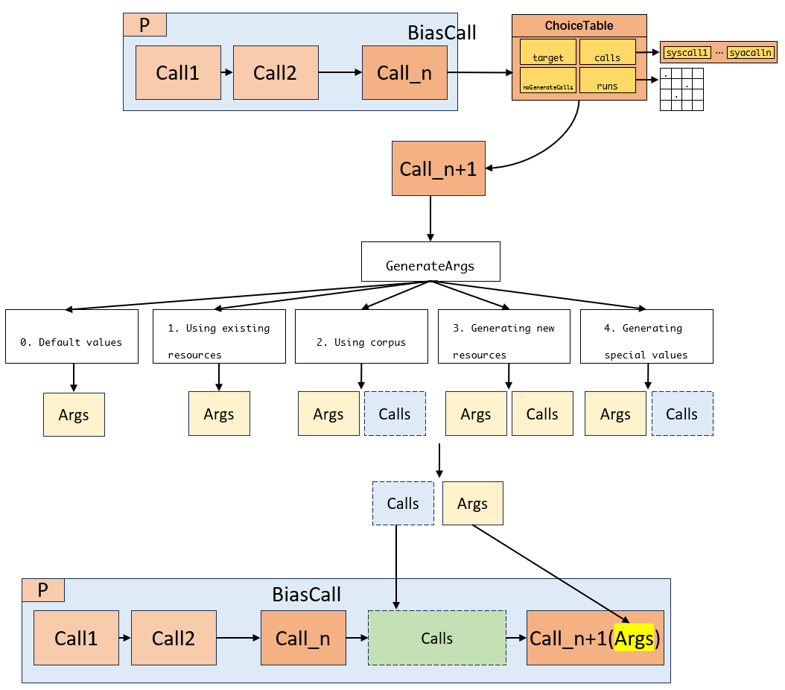

# How does Syzkaller generate a program (syscall sequences)?

> Hey guys! It's been a while since I last updated my blog. Of course, I haven’t been idle during this time. I successfully published a paper and received two verbal PHD offers from CUHK. Everything is getting better and I love 2025!
>
> 2025.3.23
> Xiao


## Generating a Program

Syzkaller uses a `ChoiceTable` to guide the random selection process of syscalls while ensuring the rationality of the related constraints. For example, for a syscall `accept()`:

```c
int accept(int sockfd, struct sockaddr *addr, socklen_t *addrlen);
```

It needs to accept a socket file handler (`sockfd`), an address (`addr`) and a number representing the length of the address (`addrlen`). Apparently, `int sockfd` should be return value of some functions like `socket()`. A random integer would most likely not trigger any meaningful behavior. 

There comes the problem, *the actual range represented by the type of a parameter (`int`) in function signatures is often larger than the range of values practically meaningful (`sockfd`).* Function signatures are not suitable guidance. To this end, Syzkaller uses [syz-lang](https://github.com/google/syzkaller/blob/master/docs/syscall_descriptions_syntax.md) (Syscall description language) to specifically describe the source type, read/write direction and other attributes of the parameters of syscalls.

```syz-lang
accept$inet(fd sock_in, peer ptr[out, sockaddr_in, opt],
            peerlen ptr[inout, len[peer, int32]]) sock_in
```

------

I'm not going to be a syz-lang expert here so let's dive into the code. Syzkaller use `Generate()` to generate specific length, randomly chosen syscall sequences(`Prog`):

```go
// prog/generation.go
// Generate generates a random program with ncalls calls.
// ct contains a set of allowed syscalls, if nil all syscalls are used.
func (target *Target) Generate(rs rand.Source, ncalls int, ct *ChoiceTable) *Prog {
	p := &Prog{
		Target: target,
	}
	r := newRand(target, rs)
	s := newState(target, ct, nil)
	for len(p.Calls) < ncalls {
		calls := r.generateCall(s, p, len(p.Calls))
		for _, c := range calls {
			s.analyze(c)
			p.Calls = append(p.Calls, c)
		}
	}
	// For the last generated call we could get additional calls that create
	// resources and overflow ncalls. Remove some of these calls.
	// The resources in the last call will be replaced with the default values,
	// which is exactly what we want.
	for len(p.Calls) > ncalls {
		p.RemoveCall(ncalls - 1)
	}
	p.sanitizeFix()
	p.debugValidate()
	return p
}
```

The logic is simple. It continually generate one or more `Calls` and add it/them to the end of sequence until it meets the length. `ChoiceTable` is the key struct to direct the syscall selection:

```go
// ChooseTable allows to do a weighted choice of a syscall for a given syscall
// based on call-to-call priorities and a set of enabled and generatable syscalls.
type ChoiceTable struct {
	target          *Target
	runs            [][]int32
	calls           []*Syscall
	noGenerateCalls map[int]bool
}
```

`ct.runs` maintaions an integer two-dimensional array, where each value represents the probability of achieving new coverage by appending syscall Y to a syscall sequence containing X. When choosing a new syscall, Syzkaller needs to determine a *biasCall* within the existing sequence to select which row in the choice table:

```go
func (r *randGen) generateCall(s *state, p *Prog, insertionPoint int) []*Call {
	biasCall := -1
	if insertionPoint > 0 {
		// Choosing the base call is based on the insertion point of the new calls sequence.
		insertionCall := p.Calls[r.Intn(insertionPoint)].Meta
		if !insertionCall.Attrs.NoGenerate {
			// We must be careful not to bias towards a non-generatable call.
			biasCall = insertionCall.ID
		}
	}
    // get a new call from ct
	idx := s.ct.choose(r.Rand, biasCall)
	meta := r.target.Syscalls[idx]
	return r.generateParticularCall(s, meta)
}
```

`generateCall` gets `biasCall` from args. If `biasCall` is -1 Syzkaller will choose a random bias call from existing sequence. 



Syzkaller continuously selects new calls from the choice table and generates arguments for them. Due to argument dependency constraints, the generated arguments may include additional calls (green one in fig). Syzkaller then incorporates these calls into the sequence to produce valid arguments. All types and the second return value of `generate(r,s,dir)`:

| Type               | Description                                                  | Return2       |
| ------------------ | ------------------------------------------------------------ | ------------- |
| ***ResourceType*** | Return value from socket, mmap, fork,...                     | **nil/calls** |
| *BufferType*       | Buffer                                                       | nil           |
| <u>*VmaType*</u>   | Virtual memory address, like `addr` in  `mmap(addr, size, ...) ` | nil           |
| <u>*FlagsType*</u> | `O_RDWR`, `O_CREAT`, `SOCK_STREAM`, `SOCK_NONBLOCK`, ...     | nil           |
| <u>*ConstType*</u> | Const value                                                  | nil           |
| <u>*IntType*</u>   | Int variables                                                | nil           |
| <u>*ProcType*</u>  | pid, core_id, ...                                            | nil           |
| ***ArrayType***    | Array, must refer other type resources                       | **nil/calls** |
| ***StructType***   | Struct                                                       | **nil/calls** |
| ***UnionType***    | Union                                                        | **nil/calls** |
| ***PtrType***      | Pointer                                                      | **nil/calls** |
| *LenType*          | Length                                                       | nil           |
| *CsumType*         | Checksum type, usually used in network function              | nil           |

## Generating Arguments for a Call

There are five ways to generate args for a given syscall: 


### target.SpecialTypes

generateArgImpl:

```go
func (r *randGen) generateArgImpl(s *state, typ Type, dir Dir, ignoreSpecial bool) (arg Arg, calls []*Call) {
	if dir == DirOut {
		// No need to generate something interesting for output scalar arguments.
		// But we still need to generate the argument itself so that it can be referenced
		// in subsequent calls. For the same reason we do generate pointer/array/struct
		// output arguments (their elements can be referenced in subsequent calls).
		switch typ.(type) {
		case *IntType, *FlagsType, *ConstType, *ProcType, *VmaType:
			return typ.DefaultArg(dir), nil
		}
	}

	if typ.Optional() && r.oneOf(5) {
		if res, ok := typ.(*ResourceType); ok {
			v := res.Desc.Values[r.Intn(len(res.Desc.Values))]
			return MakeResultArg(typ, dir, nil, v), nil
		}
		return typ.DefaultArg(dir), nil
	}

	// Allow infinite recursion for optional pointers.
	if pt, ok := typ.(*PtrType); ok && typ.Optional() {
		switch pt.Elem.(type) {
		case *StructType, *ArrayType, *UnionType:
			name := pt.Elem.Name()
			r.recDepth[name]++
			defer func() {
				r.recDepth[name]--
				if r.recDepth[name] == 0 {
					delete(r.recDepth, name)
				}
			}()
			if r.recDepth[name] >= 3 {
				return MakeSpecialPointerArg(typ, dir, 0), nil
			}
		}
	}

	if !ignoreSpecial && dir != DirOut {
		switch typ.(type) {
		case *StructType, *UnionType:
			if gen := r.target.SpecialTypes[typ.Name()]; gen != nil {
				fmt.Print("[xiao debug] 3\n")
				return gen(&Gen{r, s}, typ, dir, nil)
			}
		}
	}

	return typ.generate(r, s, dir)
}
```

This function has five returns, three of which return `nil` calls, while the other two may not. 

```go
return gen(&Gen{r, s}, typ, dir, nil)
```

`gen` from `r.target.SpecialTypes[typ.Name()]` is one of special generating functions provided by specific target system (linux, etc.). In `sys/linux/init.go`, there definitions show as follows: 

```go
// sys/linux/init.go:57
target.SpecialTypes = map[string]func(g *prog.Gen, typ prog.Type, dir prog.Dir, old prog.Arg) (
		prog.Arg, []*prog.Call){
		"timespec":                  arch.generateTimespec,
		"timeval":                   arch.generateTimespec,
		"sockaddr_alg":              arch.generateSockaddrAlg,
		"alg_name":                  arch.generateAlgName,
		"alg_aead_name":             arch.generateAlgAeadName,
		"alg_hash_name":             arch.generateAlgHashName,
		"alg_skcipher_name":         arch.generateAlgSkcipherhName,
		"ipt_replace":               arch.generateIptables,
		"ip6t_replace":              arch.generateIptables,
		"arpt_replace":              arch.generateArptables,
		"ebt_replace":               arch.generateEbtables,
		"usb_device_descriptor":     arch.generateUsbDeviceDescriptor,
		"usb_device_descriptor_hid": arch.generateUsbHidDeviceDescriptor,
	}
```

If the args of a syscall is a special value type like timespec, ip tables, etc., these generator functions can help produce more reasonable parameters.

| Name                           | Desciption                                                   | Return2   |
| ------------------------------ | ------------------------------------------------------------ | --------- |
| *generateTimespec*             | `struct timespec { time_t tv_sec = 0;     long tv_nsec = 10_000_000; // 10ms };` | calls     |
| *generateSockaddrAlg*          |                                                              | nil/calls |
| *generateAlgName*              |                                                              | nil       |
| *generateAlgAeadName*          |                                                              | nil       |
| *generateAlgHashName*          |                                                              | nil       |
| *generateAlgSkcipherhName*     |                                                              | nil       |
| *generateIptables*             |                                                              | nil/calls |
| *generateArptables*            |                                                              | nil/calls |
| *generateEbtables*             |                                                              | nil/calls |
| generateUsbDeviceDescriptor    |                                                              | nil/calls |
| generateUsbHidDeviceDescriptor |                                                              | nil/calls |

PtrType.generate:

```go
func (a *PtrType) generate(r *randGen, s *state, dir Dir) (arg Arg, calls []*Call) {
	// The resource we are trying to generate may be in the pointer,
	// so don't try to create an empty special pointer during resource generation.
	if !r.inGenerateResource && r.oneOf(1000) {
		index := r.rand(len(r.target.SpecialPointers))
		return MakeSpecialPointerArg(a, dir, index), nil
	}
	inner, calls := r.generateArg(s, a.Elem, a.ElemDir)
	arg = r.allocAddr(s, a, dir, inner.Size(), inner)
	return arg, calls
}
```


### References

- 