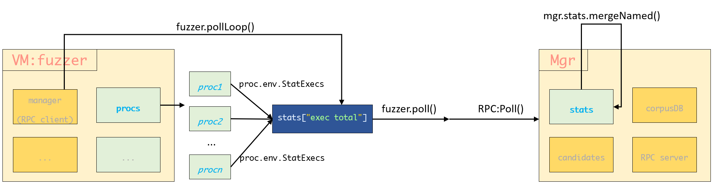
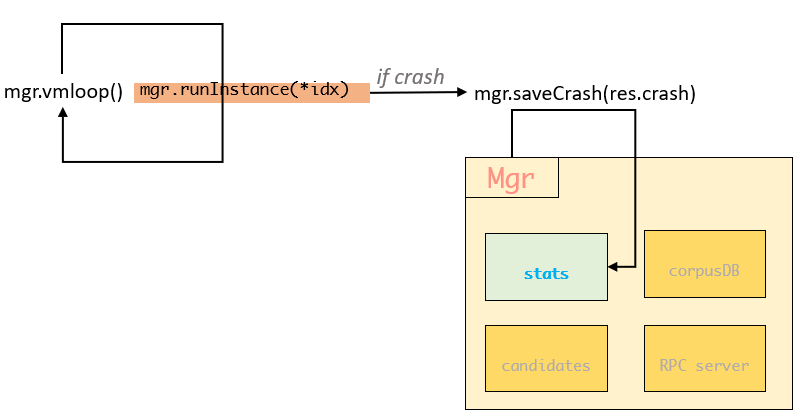

# How does Syz-manager synchronize statistics information with fuzzers?

>How does Syz-manager gets crashes, total execution times, ... , during the fuzzing process?


Manager uses integer `Stat` as info unit and defines the following methods:

```go
type Stat uint64

func (s *Stat) get() uint64 {
	return atomic.LoadUint64((*uint64)(s))
}

func (s *Stat) inc() {
	s.add(1)
}

func (s *Stat) add(v int) {
	atomic.AddUint64((*uint64)(s), uint64(v))
}

func (s *Stat) set(v int) {
	atomic.StoreUint64((*uint64)(s), uint64(v))
}
```

Manager mantains the `Stats` representing the statistics info:

```go
type Stats struct {
	crashes             Stat
	crashTypes          Stat
	crashSuppressed     Stat
	vmRestarts          Stat
	newInputs           Stat
	rotatedInputs       Stat
	execTotal           Stat
	hubSendProgAdd      Stat
	hubSendProgDel      Stat
	hubSendRepro        Stat
	hubRecvProg         Stat
	hubRecvProgDrop     Stat
	hubRecvRepro        Stat
	hubRecvReproDrop    Stat
	corpusCover         Stat
	corpusCoverFiltered Stat
	corpusSignal        Stat
	maxSignal           Stat

	mu         sync.Mutex
	namedStats map[string]uint64
	haveHub    bool
}
```

When starting the manager, a goroutine will be set:

```go
//manager.go:RunManager()
go func() {
    for lastTime := time.Now(); ; {
        time.Sleep(10 * time.Second)
        now := time.Now()
        diff := now.Sub(lastTime)
        lastTime = now
        mgr.mu.Lock()
        if mgr.firstConnect.IsZero() {
            mgr.mu.Unlock()
            continue
        }
        mgr.fuzzingTime += diff * time.Duration(atomic.LoadUint32(&mgr.numFuzzing))
        executed := mgr.stats.execTotal.get()
        crashes := mgr.stats.crashes.get()
        corpusCover := mgr.stats.corpusCover.get()
        corpusSignal := mgr.stats.corpusSignal.get()
        maxSignal := mgr.stats.maxSignal.get()
        triageQLen := len(mgr.candidates)
        mgr.mu.Unlock()
        numReproducing := atomic.LoadUint32(&mgr.numReproducing)
        numFuzzing := atomic.LoadUint32(&mgr.numFuzzing)

        log.Logf(0, "VMs %v, executed %v, cover %v, signal %v/%v, crashes %v, repro %v, triageQLen %v",
                 numFuzzing, executed, corpusCover, corpusSignal, maxSignal, crashes, numReproducing, triageQLen)
    }
}()
```

This code snippet gets the current time, loads the info and prints them every 10 seconds.

## Total Execution

`mergeNamed` incorporates the input map into `mgr.Stats`:

```go
func (stats *Stats) mergeNamed(named map[string]uint64) {
	stats.mu.Lock()
	defer stats.mu.Unlock()
	if stats.namedStats == nil {
		stats.namedStats = make(map[string]uint64)
	}
	for k, v := range named {
		switch k {
        // Add the exec total
		case "exec total":
			stats.execTotal.add(int(v))
		default:
			stats.namedStats[k] += v
		}
	}
}
```

This function is invoked within the Poll function:

```go
func (serv *RPCServer) Poll(a *rpctype.PollArgs, r *rpctype.PollRes) error {
	serv.stats.mergeNamed(a.Stats)

	serv.mu.Lock()
	defer serv.mu.Unlock()
    ...
}
```

Fuzzers collect all `proc.env.StatExecs`, add them together and send them to manager through `RPC:Poll()` in function `poll()`.



`proc.env.StatExecs` is updated in function `proc.env.Exec`:

```go
// Exec starts executor binary to execute program p and returns information about the execution:
// output: process output
// info: per-call info
// hanged: program hanged and was killed
// err0: failed to start the process or bug in executor itself.
func (env *Env) Exec(opts *ExecOpts, p *prog.Prog) (output []byte, info *ProgInfo, hanged bool, err0 error) {
	//...
	atomic.AddUint64(&env.StatExecs, 1)
	//...
}
```


## Crashes

Getting crashes is from the return results of `mgr.runInstance()` which start the VM and run syz-fuzzer in it.  Since **syz-fuzzer** itself runs in an infinite loop, the termination of the `mgr.runInstance()` is most likely due to a crash.

```go
func (mgr *Manager) vmLoop() {
	log.Logf(0, "booting test machines...")
	log.Logf(0, "wait for the connection from test machine...")
	//...
	runDone := make(chan *RunResult, 1)
	//...
	for shutdown != nil || instances.Len() != vmCount {
		// ...
		
		if shutdown != nil {
			// ...
			for !canRepro() {
				// ...
				log.Logf(1, "loop: starting instance %v", *idx)
				// 开始fuzzing
				go func() {
					// 运行第idx个VM, 返回结果，如果crash不为nil则表明发生崩溃
					crash, err := mgr.runInstance(*idx)
					runDone <- &RunResult{*idx, crash, err}
				}()
			}
		}

		//...

	wait:
		select {
		// ...
		// 产生了crash
		case res := <-runDone:
			log.Logf(1, "loop: instance %v finished, crash=%v", res.idx, res.crash != nil)
			if res.err != nil && shutdown != nil {
				log.Logf(0, "%v", res.err)
			}
			stopPending = false
			instances.Put(res.idx)
			// On shutdown qemu crashes with "qemu: terminating on signal 2",
			// which we detect as "lost connection". Don't save that as crash.
			if shutdown != nil && res.crash != nil {
				needRepro := mgr.saveCrash(res.crash)
				// ...
			}
		//...
		}
	}
}
```




## References

- How to log msg in syz-fuzzer: https://groups.google.com/g/syzkaller/c/CKcFAS1Z_jY

