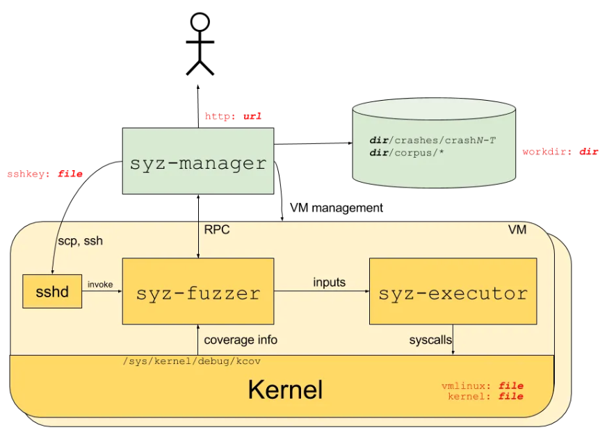
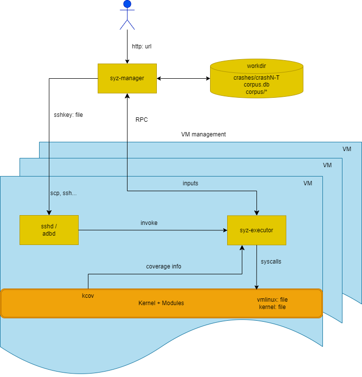
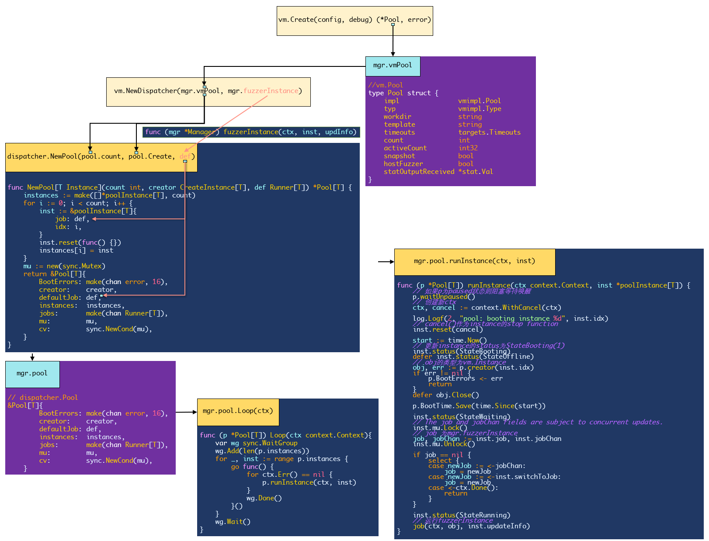
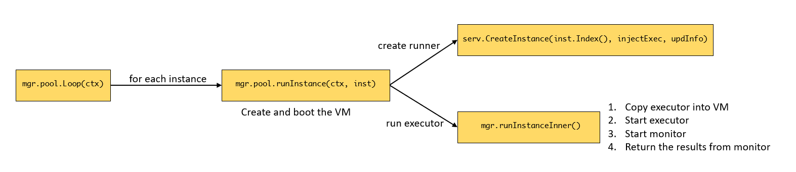
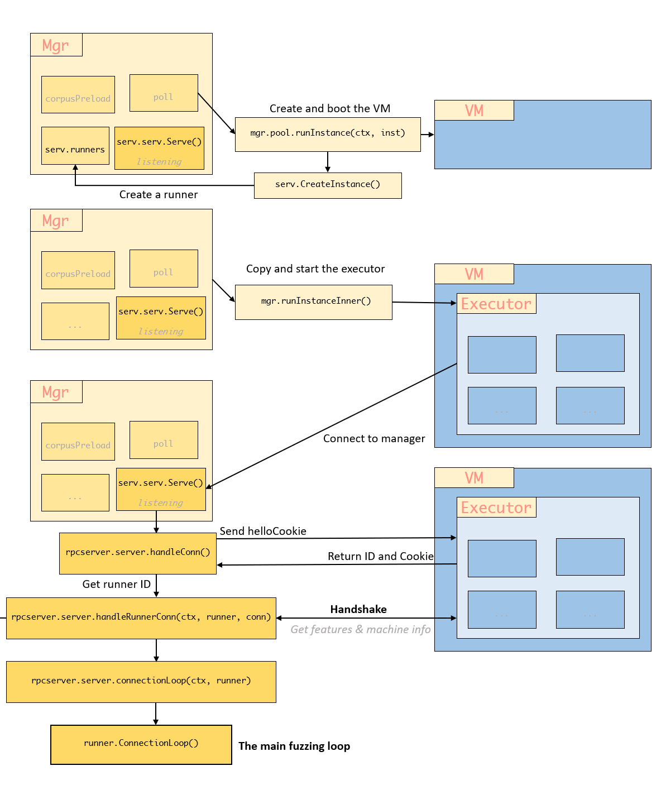
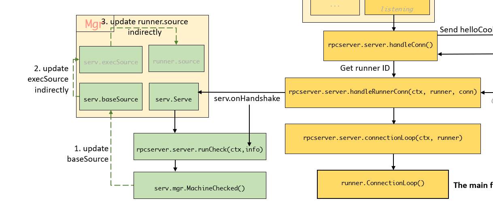
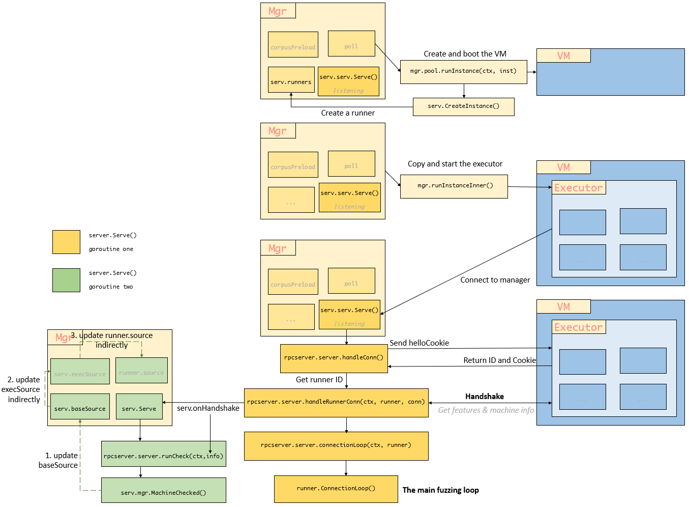
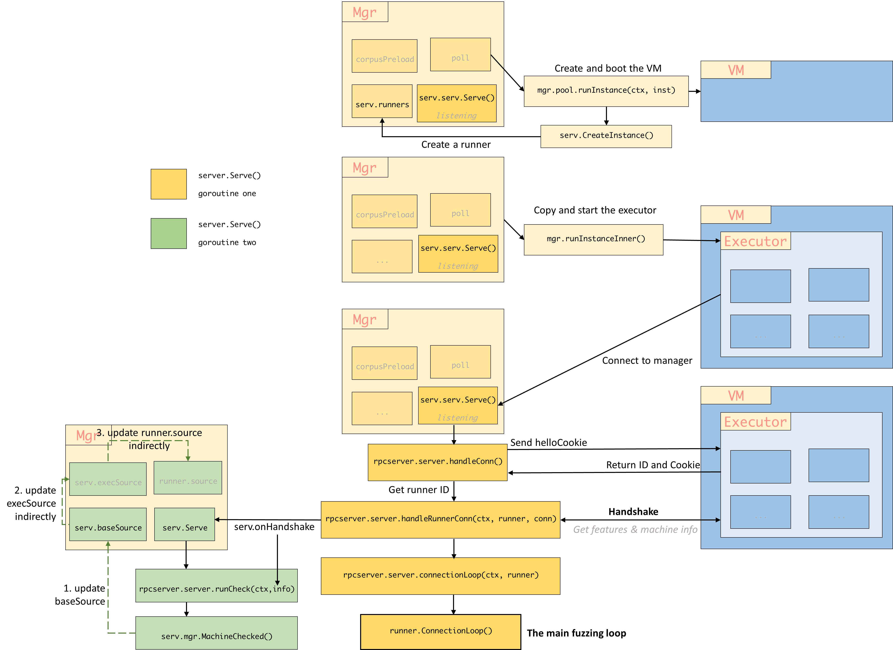

# (Syzkaller)New version of syz-manager

>Some new features compared to old version of syzkaller.


Old syzkaller:



New syzkaller:



Syzkaller moved all syz-fuzzer logic into syz-executor and removed syz-fuzzer in commit `e16e2c9a4cb6937323e861b646792a6c4c978a3c` (Jun 4th 2024). Changes in syz-manager logic are as follows.

### Mode

```go
type Mode struct {
	Name                  string
	Description           string
	UseDashboard          bool // the mode connects to dashboard/hub
	LoadCorpus            bool // the mode needs to load the corpus
	ExitAfterMachineCheck bool // exit with 0 status when machine check is done
	// Exit with non-zero status and save the report to workdir/report.json if any kernel crash happens.
	FailOnCrashes bool
	CheckConfig   func(cfg *mgrconfig.Config) error
}
```

```go
modes = []*Mode{
		ModeFuzzing,
		ModeSmokeTest,
		ModeCorpusTriage,
		ModeCorpusRun,
		ModeRunTests,
		ModeIfaceProbe,
	}
```

`modes` defines the startup modes of the manager, which include:

- ModeFuzzing:

```go
ModeFuzzing = &Mode{
		Name:         "fuzzing",
		Description:  `the default continuous fuzzing mode`,
		UseDashboard: true,
		LoadCorpus:   true,
	}
```

- ModeSmokeTest:

```go
ModeSmokeTest = &Mode{
		Name: "smoke-test",
		Description: `run smoke test for syzkaller+kernel
	The test consists of booting VMs and running some simple test programs
	to ensure that fuzzing can proceed in general. After completing the test
	the process exits and the exit status indicates success/failure.
	If the kernel oopses during testing, the report is saved to workdir/report.json.`,
		ExitAfterMachineCheck: true,
		FailOnCrashes:         true,
	}
```

Smoke testing is a preliminary software testing method that determines whether the employed build is stable enough to proceed with further testing.

- ModeCorpusTriage:

```go
ModeCorpusTriage = &Mode{
		Name: "corpus-triage",
		Description: `triage corpus and exit
	This is useful mostly for benchmarking with testbed.`,
		LoadCorpus: true,
	}
```

- ModeCorpusRun:

```go
ModeCorpusRun = &Mode{
		Name:        "corpus-run",
		Description: `continuously run the corpus programs`,
		LoadCorpus:  true,
	}
```

- ModeRunTests:

```go
ModeRunTests = &Mode{
		Name: "run-tests",
		Description: `run unit tests
	Run sys/os/test/* tests in various modes and print results.`,
	}
```

- ModeIfaceProbe:

```go
ModeIfaceProbe = &Mode{
		Name: "iface-probe",
		Description: `run dynamic part of kernel interface auto-extraction
	When the probe is finished, manager writes the result to workdir/interfaces.json file and exits.`,
		CheckConfig: func(cfg *mgrconfig.Config) error {
			if cfg.Snapshot {
				return fmt.Errorf("snapshot mode is not supported")
			}
			if cfg.Sandbox != "none" {
				return fmt.Errorf("sandbox \"%v\" is not supported (only \"none\")", cfg.Sandbox)
			}
			if !cfg.Cover {
				return fmt.Errorf("coverage is required")
			}
			return nil
		},
	}
```

### Pool & Instance

Syzkaller uses vm pool to manage the VM execution:

```
vm.Pool (高级抽象)
    |
    ├── vm.Dispatcher (基于 Pool 的调度器)
    |       |
    |       └── Pool[Instance] (泛型池)
    |           |
    |           ├── poolInstance[Instance] (包装器)
    |           |     |
    |           |     └── Instance (具体虚拟机实例)
    |           |
    |           ├── Runner[Instance] (执行逻辑)
    |
    └── 物理/虚拟的机器资源
```

```go
// Pool[T] provides the functionality of a generic pool of instances.
// The instance is assumed to boot, be controlled by one Runner and then be re-created.
// The pool is assumed to have one default Runner (e.g. to be used for fuzzing), while a
// dynamically controlled sub-pool might be reserved for the arbitrary Runners.
type Pool[T Instance] struct {
	BootErrors chan error
	BootTime   stat.AverageValue[time.Duration]

	creator    CreateInstance[T]
	defaultJob Runner[T]
	jobs       chan Runner[T]

	// The mutex serializes ReserveForRun() and SetDefault() calls.
	mu        *sync.Mutex
	cv        *sync.Cond
	instances []*poolInstance[T]
	paused    bool
}
```


#### 1. vm.Instance

Package `vm` defines the type representing VM `Instance` and corresponding methods:

```go
type Instance struct {
    pool          *Pool
    impl          vmimpl.Instance
    workdir       string
    index         int
    snapshotSetup bool
    onClose       func()
}
```

- Copy files into VM:

```go
func (inst *Instance) Copy(hostSrc string) (string, error) {
	return inst.impl.Copy(hostSrc)
}
```

- Set TCP port (for RPC):

```go
func (inst *Instance) Forward(port int) (string, error) {
	return inst.impl.Forward(port)
}
```

- Run runs cmd inside of the VM and monitors command execution and the kernel console output:

```go
func (inst *Instance) Run(timeout time.Duration, reporter *report.Reporter, command string, opts ...any) ([]byte, *report.Report, error) {
//...
}
```

- Get the index of the instance:

```go
func (inst *Instance) Index() int {
	return inst.index
}
```

- Close the instance:

```go
func (inst *Instance) Close() error {
	err := inst.impl.Close()
	if retErr := os.RemoveAll(inst.workdir); err == nil {
		err = retErr
	}
	inst.onClose()
	return err
}
```

- Snapshot:

```go
// SetupSnapshot must be called once before calling RunSnapshot.
// Input is copied into the VM in an implementation defined way and is interpreted by executor.
func (inst *Instance) SetupSnapshot(input []byte) error {
	impl, ok := inst.impl.(snapshotter)
	if !ok {
		return errors.New("this VM type does not support snapshot mode")
	}
	if inst.snapshotSetup {
		return fmt.Errorf("SetupSnapshot called twice")
	}
	inst.snapshotSetup = true
	return impl.SetupSnapshot(input)
}

// RunSnapshot runs one input in snapshotting mode.
// Input is copied into the VM in an implementation defined way and is interpreted by executor.
// Result is the result provided by the executor.
// Output is the kernel console output during execution of the input.
func (inst *Instance) RunSnapshot(input []byte) (result, output []byte, err error) {
	impl, ok := inst.impl.(snapshotter)
	if !ok {
		return nil, nil, errors.New("this VM type does not support snapshot mode")
	}
	if !inst.snapshotSetup {
		return nil, nil, fmt.Errorf("RunSnapshot without SetupSnapshot")
	}
	// Executor has own timeout logic, so use a slightly larger timeout here.
	timeout := inst.pool.timeouts.Program / 5 * 7
	return impl.RunSnapshot(timeout, input)
}
```

#### 2. dispatcher.poolInstance

```go
// poolInstance is not thread safe.
type poolInstance[T Instance] struct {
	mu   sync.Mutex
	info Info
	idx  int

	// Either job or jobChan will be set.
	job         Runner[T]
	jobChan     chan Runner[T]
	switchToJob chan Runner[T]
	stop        func()
}
```

### fuzzer.Queue

Package `queue` defines a series of queue functions and methods used for executing programs and managing the process. Fuzzer maintains five kinds of `execQueue` for different scenarios：

```go
type execQueues struct {
	triageCandidateQueue *queue.DynamicOrderer
	candidateQueue       *queue.PlainQueue
	triageQueue          *queue.DynamicOrderer
	smashQueue           *queue.PlainQueue
	source               queue.Source
}
```

The queue are either `*queue.DynamicOrderer` which can change the priority dynamically:

```go
type DynamicOrderer struct {
	mu       sync.Mutex
	currPrio int
	ops      *priorityQueueOps[*Request]
}
```

Or `*queue.PlainQueue` which is a straighforward thread-safe Request queue implementation.:

```go
type PlainQueue struct {
	mu    sync.Mutex
	queue []*Request
	pos   int
}
```

`execQueues` is initialized in `NewFuzzer():newExecQueues()`:

```go
func newExecQueues(fuzzer *Fuzzer) execQueues {
	ret := execQueues{
		triageCandidateQueue: queue.DynamicOrder(),
		candidateQueue:       queue.Plain(),
		triageQueue:          queue.DynamicOrder(),
		smashQueue:           queue.Plain(),
	}
	// Alternate smash jobs with exec/fuzz to spread attention to the wider area.
	skipQueue := 3
	if fuzzer.Config.PatchTest {
		// When we do patch fuzzing, we do not focus on finding and persisting
		// new coverage that much, so it's reasonable to spend more time just
		// mutating various corpus programs.
		skipQueue = 2
	}
	// Sources are listed in the order, in which they will be polled.
	ret.source = queue.Order(
		ret.triageCandidateQueue,
		ret.candidateQueue,
		ret.triageQueue,
		queue.Alternate(ret.smashQueue, skipQueue),
		queue.Callback(fuzzer.genFuzz),
	)
	return ret
}
```


### RunManager(mode *Mode, cfg *mgrconfig.Config)

New manager uses `mgr.corpusPreload` to store the candidates which was `mgr.candidates` in old manager:

```go
mgr := &Manager{
		cfg:                cfg,
		mode:               mode,
		vmPool:             vmPool,
		corpusPreload:      make(chan []fuzzer.Candidate),
		//...
	}
```

```go
// packge fuzzer
type Candidate struct {
	Prog  *prog.Prog
	Flags ProgFlags
}
```

After initializing the `mgr` and building the HTTPServer, manager decides whether to load corpus based on parameter `mgr.mode.LoadCorpus`.

```go
if mgr.mode.LoadCorpus {
    go mgr.preloadCorpus()
} else {
    // close the chan []fuzzer.Candidate
    close(mgr.corpusPreload)
}
```

The old logging function in manager was:

```go
// old_manager
go func() {
    for lastTime := time.Now(); ; {
        time.Sleep(10 * time.Second)
        now := time.Now()
        diff := now.Sub(lastTime)
        lastTime = now
        mgr.mu.Lock()
        if mgr.firstConnect.IsZero() {
            mgr.mu.Unlock()
            continue
        }
        mgr.fuzzingTime += diff * time.Duration(atomic.LoadUint32(&mgr.numFuzzing))
        executed := mgr.stats.execTotal.get()
        crashes := mgr.stats.crashes.get()
        corpusCover := mgr.stats.corpusCover.get()
        corpusSignal := mgr.stats.corpusSignal.get()
        maxSignal := mgr.stats.maxSignal.get()
        triageQLen := len(mgr.candidates)
        mgr.mu.Unlock()
        numReproducing := atomic.LoadUint32(&mgr.numReproducing)
        numFuzzing := atomic.LoadUint32(&mgr.numFuzzing)

        log.Logf(0, "VMs %v, executed %v, cover %v, signal %v/%v, crashes %v, repro %v, triageQLen %v",
                 numFuzzing, executed, corpusCover, corpusSignal, maxSignal, crashes, numReproducing, triageQLen)
    }
}()
```

This one was wrapped into `mgr.heartbeatLoop()` in new manager:

```go
func (mgr *Manager) heartbeatLoop() {
	lastTime := time.Now()
	for now := range time.NewTicker(10 * time.Second).C {
		diff := int(now.Sub(lastTime))
		lastTime = now
		if mgr.firstConnect.Load() == 0 {
			continue
		}
		// 如果已经连接至少一个fuzzer
		mgr.statFuzzingTime.Add(diff * mgr.servStats.StatNumFuzzing.Val())
		buf := new(bytes.Buffer)
		for _, stat := range stat.Collect(stat.Console) {
            // 打印所有信息
            // 例如：
            // candidates=0 corpus=4308 coverage=53288 exec total=123881 (74/sec) pending=0 reproducing=0
			fmt.Fprintf(buf, "%v=%v ", stat.Name, stat.Value)
		}
		log.Logf(0, "%s", buf.String())
	}
}
```

New manager add function `mgr.processFuzzingResults()` which was part of old `mgr.vmLoop()`:

```go
func (mgr *Manager) processFuzzingResults(ctx context.Context) {
	for {
		select {
		case <-ctx.Done():
			return
		case crash := <-mgr.crashes:
			needRepro := mgr.saveCrash(crash)
			if mgr.cfg.Reproduce && needRepro {
				mgr.reproLoop.Enqueue(crash)
			}
		case err := <-mgr.pool.BootErrors:
			crash := mgr.convertBootError(err)
			if crash != nil {
				mgr.saveCrash(crash)
			}
		case crash := <-mgr.externalReproQueue:
			if mgr.NeedRepro(crash) {
				mgr.reproLoop.Enqueue(crash)
			}
		}
	}
}
```

### mgr.vmLoop() --> mgr.pool.Loop(ctx context.Context)

Old function `mgr.vmLoop()` was substituted for `mgr.pool.Loop(ctx context.Context)`.

```go
func (p *Pool[T]) Loop(ctx context.Context) {
	var wg sync.WaitGroup
	wg.Add(len(p.instances))
	for _, inst := range p.instances {
		go func() {
			for ctx.Err() == nil {
				p.runInstance(ctx, inst)
			}
			wg.Done()
		}()
	}
	wg.Wait()
}
```

### Pool[T].runInstance()

```go
func (p *Pool[T]) runInstance(ctx context.Context, inst *poolInstance[T]) {
    // 如果p为paused状态则阻塞等待唤醒
	p.waitUnpaused()
	ctx, cancel := context.WithCancel(ctx)

	log.Logf(2, "pool: booting instance %d", inst.idx)

	inst.reset(cancel)

	start := time.Now()
	inst.status(StateBooting)
	defer inst.status(StateOffline)

	obj, err := p.creator(inst.idx)
	if err != nil {
		p.BootErrors <- err
		return
	}
	defer obj.Close()

	p.BootTime.Save(time.Since(start))

	inst.status(StateWaiting)
	// The job and jobChan fields are subject to concurrent updates.
	inst.mu.Lock()
	job, jobChan := inst.job, inst.jobChan
	inst.mu.Unlock()

	if job == nil {
		select {
		case newJob := <-jobChan:
			job = newJob
		case newJob := <-inst.switchToJob:
			job = newJob
		case <-ctx.Done():
			return
		}
	}

	inst.status(StateRunning)
	job(ctx, obj, inst.updateInfo)
}
```

#### **1. How does new manager run VMs?**

##### 1.1 vm.Pool &  dispatcher.Pool

`vm.Pool` is used for managing and scheduling VMs, containing basic information of VMs, including: 

```go
type Pool struct {
    // 具体虚拟机实现（QEMU/GCE 等）
	impl               vmimpl.Pool
	typ                vmimpl.Type
	workdir            string
	template           string
	timeouts           targets.Timeouts
    // 最大虚拟机数量
	count              int
    // 当前活跃的虚拟机数量
	activeCount        int32
    // 是否启用快照
	snapshot           bool
	hostFuzzer         bool
	statOutputReceived *stat.Val
}
```

There are three methods implemented for `vm.Pool`:

- `Count()`: return pool.count
- `Create(index int)(*Instance, error)`: Create `Instance` and boot the VMs
- `Close() error`: Close the VMs

`dispatcher.Pool` is used for managing the fuzzing process:

```go
// Pool[T] provides the functionality of a generic pool of instances.
// The instance is assumed to boot, be controlled by one Runner and then be re-created.
// The pool is assumed to have one default Runner (e.g. to be used for fuzzing), while a
// dynamically controlled sub-pool might be reserved for the arbitrary Runners.
type Pool[T Instance] struct {
	BootErrors chan error
	BootTime   stat.AverageValue[time.Duration]
    // 创建虚拟机的函数，通常为vm.Poll.Create()
	creator    CreateInstance[T]
	defaultJob Runner[T]
    // 任务队列
	jobs       chan Runner[T]

	// The mutex serializes ReserveForRun() and SetDefault() calls.
	mu        *sync.Mutex
	cv        *sync.Cond
    //  虚拟机实例的状态管理
	instances []*poolInstance[T]
	paused    bool
}
```

There are 10 methods implemented for `dispatcher.Pool`, some of them are:

- `waitUnpaused()`: If Pool is paused, wait until wake up.

- `Loop(ctx context.Context)`: Run each instance in Pool.
- `runInstance(ctx context.Context, inst *poolInstance[T])`: Create and boot the VM, update the status, and run the job of the instance.
- `ReserveForRun(count int)`: Reserve instances for special tasks.
- `Run(job Runner[T])`: Run the job
- `Total() int`: return len(p.instances)
- `State() []Info`: Return all informantion of instances.

The connection between these two kinds of `Pool` is using `vmpool.count` and `vmpool.Create()`as the length of instances and the default job of instance when manager create the dispatcher:



The VM is created and boot this way:



#### **2. How does new manager start fuzzing?**

##### 2.1 rpcserver.server.Serve()

Function `Serve()` starts two go routines, one is for handshake with executor and the other is for machine check after handshaking.

```go
func (serv *server) Serve(ctx context.Context) error {
	g, ctx := errgroup.WithContext(ctx)
    // 第一个go routine
	g.Go(func() error {
		return serv.serv.Serve(ctx, func(ctx context.Context, conn *flatrpc.Conn) error {
			err := serv.handleConn(ctx, conn)
			if err != nil && !errors.Is(err, errFatal) {
				log.Logf(2, "%v", err)
				return nil
			}
			return err
		})
	})
    // 第二个go routine
	g.Go(func() error {
		var info *handshakeResult
		select {
		case <-ctx.Done():
			return nil

		case info = <-serv.onHandshake:
		}
		// 如果收到握手信息
		// We run the machine check specifically from the top level context,
		// not from the per-connection one.
		return serv.runCheck(ctx, info)
	})
	return g.Wait()
}
```

- The first go routine, wait and handshake with executor:



- The second go routine, wait until the handshake finished, create fuzzer and update the runner source:



The function `mgr.MachineChecked` builds the `fuzzerObj`, loads the corpus into `fuzzer.candidateQueue`, and update the source of runner. The whole process of `Serv()`:



##### 2.2 Runner

##### 2.3 Distributor

Distributor distributes requests to different VMs during input triage:

```go
// Distributor distributes requests to different VMs during input triage
// (allows to avoid already used VMs).
type Distributor struct {
	source        Source
	seq           atomic.Uint64
	empty         atomic.Bool
	active        atomic.Pointer[[]atomic.Uint64]
	mu            sync.Mutex
	queue         []*Request
	statDelayed   *stat.Val
	statUndelayed *stat.Val
	statViolated  *stat.Val
}
```

##### 2.4 fuzzer.iob

`job.go` from pkg fuzzer defines a series of 

```go
type job interface {
	run(fuzzer *Fuzzer)
}
```



## References

- Golang:
  - Golang generic type: https://www.cnblogs.com/insipid/p/17772581.html
  - Cond: https://zhuanlan.zhihu.com/p/630887340
  - Contex: https://www.cnblogs.com/asong2020/articles/13662174.html
  - Atomic: https://www.cnblogs.com/ExMan/p/12397054.html
  - Embedding types/fields: https://www.cnblogs.com/apocelipes/p/14090671.html
  - Errorgroup: https://zhuanlan.zhihu.com/p/338999914
  - Closure: https://zhuanlan.zhihu.com/p/92634505


