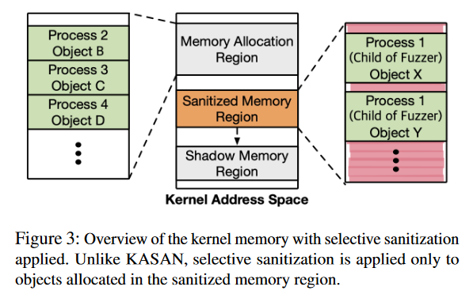
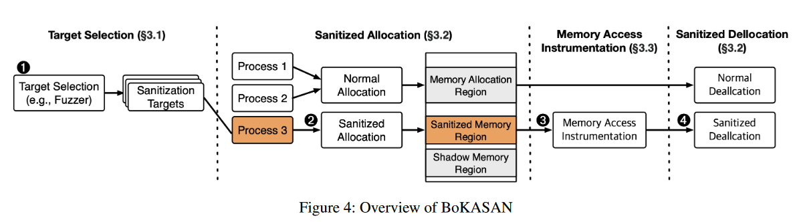
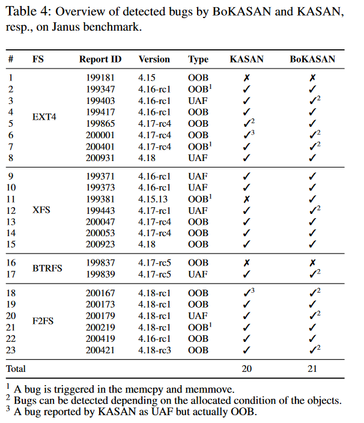
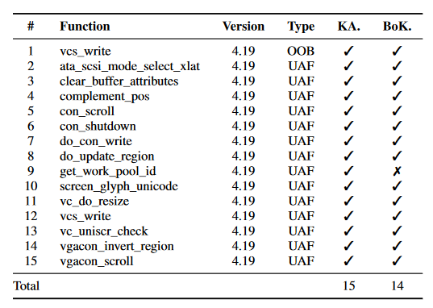
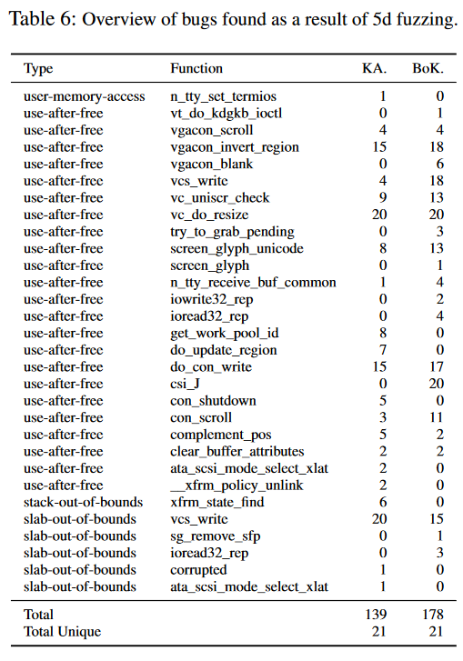
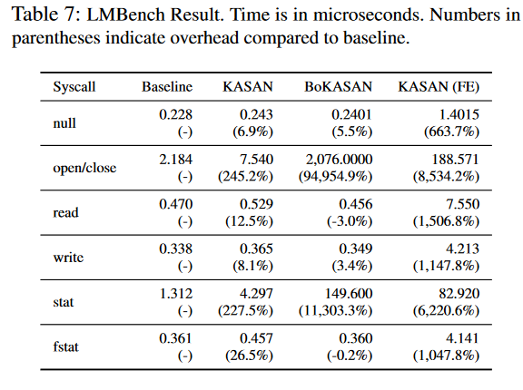
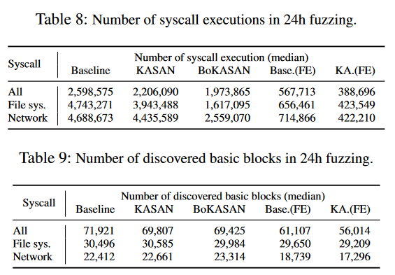
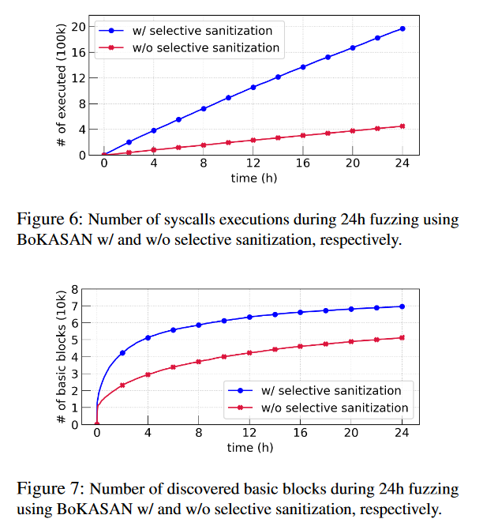
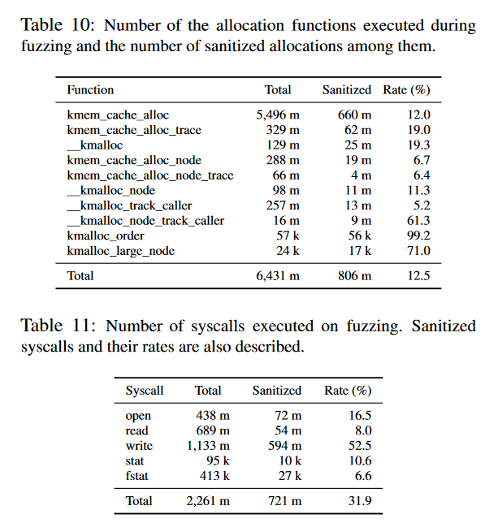
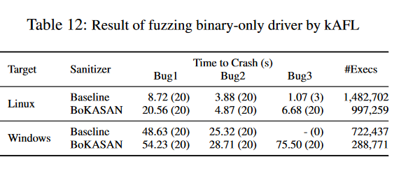

# BoKASAN: Binary-only Kernel Address Sanitizer for Effective Kernel Fuzzing

>**会议：**Security'23
>
>**作者：**Mingi Cho，Dohyeon An，Hoyong Jin，Taekyoung Kwon(Yonsei University)

## ABSTRACT

Kernel Address Sanitizer（KASAN）是在 Linux 内核中查找UAF和out-of-bounds的重要工具，但它需要内核源代码来进行编译时插桩。要将KASAN应用于闭源系统，我们必须开发一种纯二进制KASAN，而这是一项挑战。使用二进制重写和processor support来为二进制模块运行KASAN的技术需要一个已经插桩好KASAN的内核，因此仍然需要内核源代码。动态插桩提供了一种替代方法，但其大大增加了性能开销，使得内核fuzzing不切实际。

为了解决这些问题，我们提出了首个实用的二进制KASAN: BoKASAN，它可以通过动态插桩对整个内核二进制文件有效地进行sanitization。我们的关键想法是selective sanitization，它能确定要sanitize的目标进程，并hook页面故障机制，从而显著降低动态插桩的性能开销。我们的主要观点是，内核中的bug与fuzzer创建的进程最为相关。因此，BoKASAN会特意对与这些进程相关的目标内存区域进行sanitization，而对剩余内存区域则不进行 sanitization，以实现有效的内核模糊测试。

我们的评估结果表明，BoKASAN在闭源系统上非常实用，即使在纯二进制内核和模块上也能达到 KASAN 的编译器级性能。在 Linux 内核上，与 KASAN 相比，BoKASAN 在 Janus 数据集中检测到的错误略多，而在 Syzkaller/SyzVegas 数据集中检测到的错误略少；在 5 天的模糊测试中，BoKASAN 发现的唯一错误数量相同，执行的基本模块数量也相近。对于 Windows 内核和 Linux 内核的二进制模块，BoKASAN 都能有效地发现漏洞。消融结果表明，选择性 sanitizer 对这些结果产生了影响。

## Motivation

1. 许多操作系统都对UAF和out-of-bounds问题非常敏感，但现有的state-of-the-art的fuzzer很难检测它们；
2. KASAN通过编译时插桩使用，其可以检测这些bug；
3. KASAN没法直接应用于闭源系统；

综上，我们需要一个binary-only KASAN。

## Challenges

1. 由于内核庞大的体积和复杂的机制，在内核中应用动态二进制插桩会造成庞大的开销，这对fuzzing来说不可接受；
2. KRetroWrite通过静态插桩方式来提供KASAN支持，但其需要一个已经实现了KASAN功能的main kernel，所以这种方式仍需要源码。

## Approach

1. 作者原创一个名为selective santization的机制，只对fuzzer创建的进程的相关内存区域进行sanitization;
2. BoKASAN 分别动态执行 1) 函数插桩和 2) 内存访问插桩。在函数插桩时，BoKASAN 通过hook内存分配函数创建red-zone，然后初始化影子内存。在内存访问插桩方面，BoKASAN 利用了操作系统的页面故障机制。当访问 sanitizer 内存区域时，BoKASAN 会强制产生页面故障并检查阴影内存。如果访问了红色区域，BoKASAN 就会向fuzzer发出警报。

## Evaluation

>**RQ1:** Can BoKASAN successfully detect OOB and UAF bugs targeting only the kernel binary? (We tested this on a Linux kernel and compared the result with source-based KASAN.)
>
>**RQ2:** Is the amount of performance overhead incurred by BoKASAN acceptable?
>
>**RQ3:** To what extent is the selective sanitization of BoKASAN effective?
>
>**RQ4:** Can BoKASAN be applied to binary-only fuzzing?

### Dataset:

​	已知的Linux kernel bugs(包括被Syzkaller,syzVegas等找到的)。

​	首先，我们从 Janus [64] 作者向 Bugzilla 报告的 62 个 Linux 内核漏洞中挑选了 <u>23 个 OOB 和 UAF 漏洞</u>。由于目前还没有评估内核模糊的baseline，我们使用了基于 Janus 的数据集，其中包括在文件系统中发现的错误。为了尽量减少文件系统的偏差，我们选择了 Syzkaller 和 SyzVegas 在内核各组件中发现的 16 个漏洞。

### RQ1: Bug Detection

​	**针对作者选出的23个来自Janus的bug结果如下：**

​	这表明，即使 Linux 内核中没有源代码，BoKASAN 也能检测到 KASAN 可以检测到的板块 OOB 和 UAF Bug；此外，它还能检测到 KASAN 遗漏的 Bug。BoKASAN 检测到的一些错误可以根据对象的位置检测到，而它们的大部分分配功能是不确定的。当访问另一个对象的红色区域时，由于大大偏离了发生 OOB 的对象地址而触发了错误。考虑到 KASAN 会对大多数对象进行 sanitizer，即使在这种情况下也是如此、错误极有可能被检测到。BoKASAN 可以通过定期分配专用于红色区域的对象来增加已分配红色区域的总数，从而缓解这一问题。

​	由于 KASAN 使用了较小的red-zone，<u>存在着一些被检测到但被错误分类的错误</u>。表 4 中标识符为 200001 和 200167 的错误实际上是 OOB 错误，但 KASAN 将其检测为 UAF。因为 OOB 访问发生在红色区域之外，只有在实际触发错误的对象后面的其他对象被去分配时，KASAN 才能检测到错误。与 KASAN 相比，BoKASAN 使用了更大的红色区域，因此它能准确地将这些错误检测为 OOB。

​	**针对Syz dataet的检测结果如下：**

​	实验结果显示，在 15 个错误中，KASAN 和 BoKASAN 分别检测到 15 个和 14 个错误。

​	通过` tty_release` 函数触发了在 `get_work_pool_id `中检测到的一个 BoKASAN 未检测到的错误。Syzkaller 生成的该漏洞重现代码调用 `perf_event_open` 系统调用，但该系统调用与 `BoKASAN `碰撞，导致内核慌乱，因此 BoKASAN 未能检测到该漏洞。

​	但是，这并不意味着 BoKASAN 不能检测到这个错误。在检测到 `con_shutdown `中的错误后，BoKASAN 在 `release_tty `和 `__cancel_work_timer `中检测到 UAF，它们是 `get_work_pool_id `的调用者。由此可以推断，这两个 Bug 有一定的关系，如果我们能在 `get_work_pool_id `中触发 UAF，而不使用 `perf_event_open`，我们就能检测到这个 Bug。同样，KASAN 在 `do_update_region `中检测到的 bug 也被 BoKASAN 在 csi_J 中检测到。请注意，`do_update_region `是在 csi_J 中调用的。

​	经过5天的fuzzing结果如下：

​	KASAN和BoKASAN在30个unique bug中发现了21个。但BoKASAN发现的总数更多。

### RQ2: Performance

​	我们使用 LMbench 比较了 BoKASAN、baseline、KASAN 和 KASAN (FE) 的系统调用执行时间。

### RQ3: Selective Sanitization

​	

### RQ4: Binary-only Fuzzing

