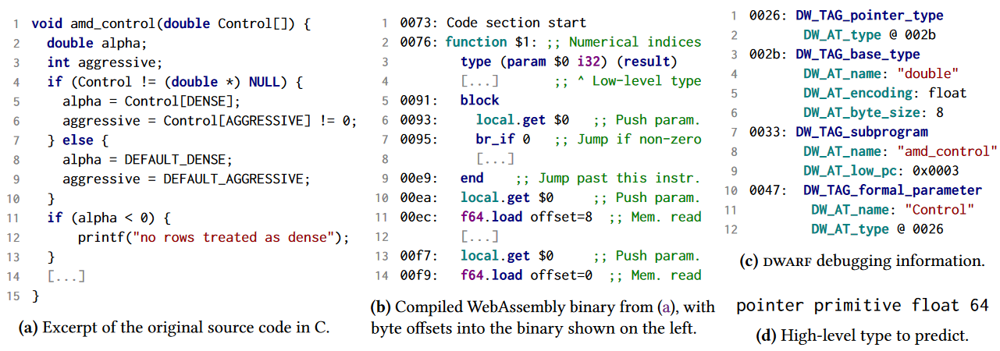

# Finding the Dwarf: Recovering Precise Types from WebAssembly Binaries

>**会议：**PLDI'22
>
>**作者：**Daniel Lehmann, Michael Pradel

## 1. 问题背景

随着WebAssembly越来越受欢迎，在越来越多的应用领域应用，Wasm逆向的需求也越来越旺盛。例如，一个开发者可能回想了解其在项目中使用的第三方Wasm module，以更加了解其exported functions。

理解一个WebAssembly binary的第一步就是理解函数的type signatures（参数、返回值）。由于type与理解底层代码高度相关，因此现有的native binary逆向工程工具都以type为目标 [12, 14, 57]。开发人员的研究也表明，static type有助于理解代码。

但Wasm binary中的函数type种类非常受限，wasm只支持i32/i64/f32/f64四种基本类型。一个i32可能是一个signed或者unsigned integer，又或者pointer。因此，如果能恢复高级语言中的type是非常有用的。

恢复高级type的一种方法是基于 "经典 "data-flow anlysis或type inference，即根据程序中值的使用方式收集约束[12]。不过，这种方法实施起来比较复杂，而且通常需要建立在繁重的分析框架上，如 BAP 或 CodeSurfer [43, 54]。支持 WebAssembly，尤其是其略显特别的堆栈机[25]，将是一项非同小可的工作。

近年来，人们提出了多种learning-based的方法来预测其他语言的类型。这些方法考虑的是native架构的二进制文件 [14, 27, 47] 或动态类型源语言，如 Python [5, 59] 和 JavaScript [28, 48, 61]。这些方法探索了不同的输入表示法，如token sequences[28]、data flow graphs[5]和与代码相关的自然语言[48]，以及不同的模型架构和训练方法，如RNN[59]、变transformers[2]、图神经网络[5]和无监督预训练[57]。

## 2. Method

几乎所有的工作都将learning-based来预测type的任务看做一个多分类任务，但多分类任务面对目标种类太多时表现并不好。

作者提出了SNOWWHITE，一个learning-based用于预测high-level function type的方法，其定义了一个自己的language来表达模型预测的type以避免多分类任务的target过多。type language从DEWAF调试信息中生成。

给定类型语言后，SnowWhite 会训练一个模型，将类型预测为一系列标记。也就是说，我们将类型预测问题表述为序列预测，而不是分类任务。序列预测的一个重要优势是，我们不必人为限制模型可选择的类型数量，而是支持（至少在原则上）无限多的类型。

